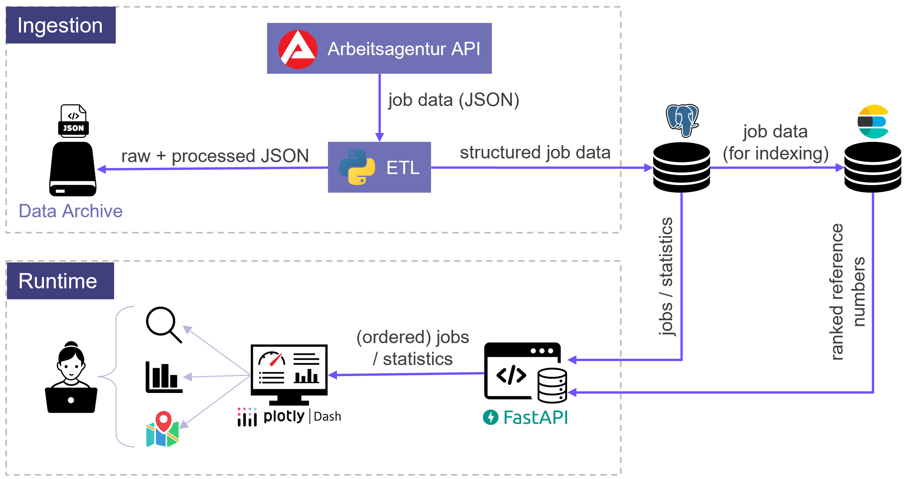

# Job Market


Job Market is an end-to-end data-engineering project for collecting, processing, searching, and analysing job advertisements from the Bundesagentur für Arbeit.

The project implements a scheduled ETL pipeline that stores raw source data, transforms and enriches job advertisements, loads them into PostgreSQL, and maintains an Elasticsearch index for full-text search. A FastAPI backend exposes the processed data to a Dash frontend for job search, geographic exploration, and statistical analysis.

The complete system runs locally through Docker Compose. Airflow orchestrates the daily ingestion workflow, while Prometheus, Pushgateway, Grafana, and Alertmanager provide operational monitoring.

## Features

- Collection of job advertisements from the Bundesagentur für Arbeit API
- Timestamped preservation of raw source data
- ETL pipeline with transformation, geocoding, and job classification
- PostgreSQL storage with update and freshness tracking
- Elasticsearch full-text search with relevance ranking
- FastAPI REST API with Swagger documentation
- Dash frontend with search, job details, maps, and statistics
- Daily orchestration with Apache Airflow
- Docker Compose deployment
- Monitoring with Prometheus, Pushgateway, Grafana, and Alertmanager

## Architecture



The data pipeline retrieves advertisements from the Bundesagentur für Arbeit, stores timestamped raw responses, transforms and enriches the records, and loads them into PostgreSQL. PostgreSQL is the authoritative data store. Elasticsearch contains a rebuildable search representation used for full-text queries.

FastAPI provides the application API, which is consumed by the Dash frontend. The recurring ETL workflow is orchestrated by Airflow. Prometheus collects application and ETL metrics, which are visualised in Grafana.

## Technology Stack

| Area | Technology |
|---|---|
| Data source | Bundesagentur für Arbeit API |
| ETL | Python, pandas |
| Database | PostgreSQL, SQLAlchemy |
| Search | Elasticsearch |
| Backend | FastAPI, Pydantic |
| Frontend | Dash, Folium |
| Orchestration | Apache Airflow |
| Deployment | Docker, Docker Compose |
| Monitoring | Prometheus, Pushgateway, Grafana, Alertmanager |

## Project Folder Structure

```text
.
├── airflow/          Airflow DAG and container configuration
├── data/             Generated raw and processed data
├── grafana/          Grafana dashboards and provisioning
├── prometheus/       Prometheus and Alertmanager configuration
├── src/
│   ├── api/          FastAPI backend
│   ├── dashboard/    Dash frontend
│   ├── data/         ETL, database access, enrichment and classification
│   ├── elasticsearch/
│   └── monitoring/
├── tests/
├── docker-compose.yml
├── Dockerfile
└── requirements.txt
```

## Usage

> **Note:** Every command in this section is assumed to be run from the project root directory.

### Populate or update the job database

Run:

```sh
./docker_update_data.sh --keyword "Data Engineer" --keyword "Data Analyst" --keyword "AI Engineer"
```

You can replace these search terms or add more --keyword arguments. If no `--keyword` arguments are provided, the default search terms configured in `src/config/settings.py` are used.

> **Note:** You can alternatively use `./docker_update_data.sh --simulate` to reset and populate the database with predefined sample data, for example if the Bundesagentur für Arbeit API is unavailable.

### Start the application with Docker

Start the application:

```sh
./docker_start.sh
```

### Open in your browser

**Swagger (Backend):** http://127.0.0.1:8000/docs

**Dash (Frontend):** http://127.0.0.1:8050

**Airflow:** http://127.0.0.1:8080

**Prometheus:** http://127.0.0.1:9090

**Prometheus-Alertmanager:** http://127.0.0.1:9093

**Grafana:** http://127.0.0.1:3000

### Local Development

#### Setup Python

```sh
python -m venv .venv
source .venv/bin/activate
python -m pip install --upgrade pip
pip install -r requirements.txt
```

> **Note:** If on Windows, run `.venv\Scripts\Activate.ps1` instead of `source .venv\bin\activate`.

#### Start PostgreSQL

> **Note:** Make sure no other containers from this project (aside from PostgreSQL) are running. If necessary, stop the full Docker deployment with `docker compose down` before running the next command.

```sh
docker compose up -d postgres
```

#### Start the backend API

```sh
python -m uvicorn src.api.main:api --reload
```

#### Start the Dash frontend

```sh
python -m src.dashboard.app
```

## Report

[Project report](docs/job-market-report.pdf)


---

> Project is based on the [Cookiecutter Data Science project template](https://drivendata.github.io/cookiecutter-data-science/). #cookiecutterdatascience
